# MemoRise

**単語暗記学習の「継続」を支援する Web アプリ。** 単語帳・テスト・学習記録を通じて、暗記の習慣化と進捗の可視化を実現します。

🔗 **本番デモ**: https://memo-rise-2.vercel.app

> スマホ（iPhone / Android）でもそのまま使えます。まずは新規登録、または公式単語帳の閲覧からお試しください。

---

## 目次

- [これは何か](#これは何か)
- [スクリーンショット](#スクリーンショット)
- [主な機能](#主な機能)
- [技術スタック](#技術スタック)
- [アーキテクチャ（本番構成）](#アーキテクチャ本番構成)
- [設計上のこだわり](#設計上のこだわり)
- [開発プロセス](#開発プロセス)
- [ローカルでの起動](#ローカルでの起動)
- [ドキュメント](#ドキュメント)

---

## これは何か

「単語帳をめくるだけでは学習が習慣化しない」「間違えた単語が放置される」「取り組み量が可視化されずモチベーションが続かない」——
そんな暗記学習の課題を解決するために作った個人開発アプリです。

- **間違えた単語を確実に復習へ** — テストの誤答をまとめて復習リストへ登録し、苦手を積み残さない。
- **続けたくなる仕組み** — 連続学習日数（streak）と学習カレンダーで「積み上がっている感覚」を可視化。
- **すぐ始められる** — 公式単語帳をプリセットで用意し、自作の手間なく学習を開始できる。

v1（Rails + Next.js）を、**GraphQL / Apollo / MUI / Rails 8** の構成で作り直した v2 です。作り直しの背景は [docs/migration-rationale.md](./docs/migration-rationale.md) を参照。

---

## スクリーンショット

> すべて本番環境の実画面です。**1 枚目のみ PC ブラウザ、以降は実機（iPhone / Safari）**で撮影しています。

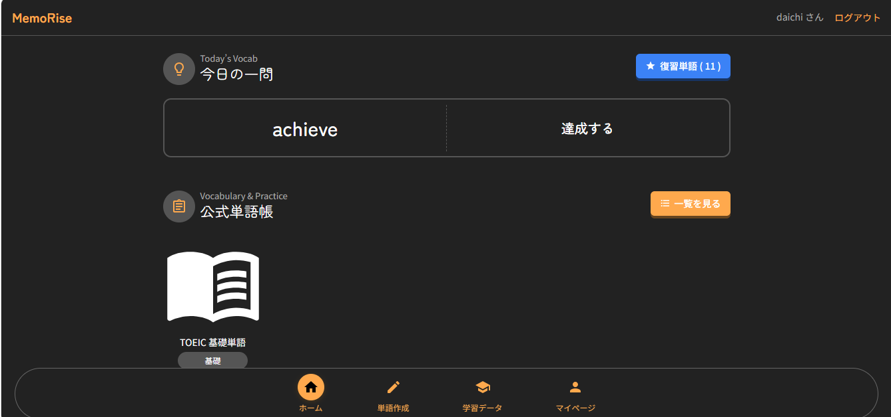

*ホーム（PC 表示）— コンテンツは中央寄せの読みやすい幅に収め、ナビゲーションはスマホと同じく画面下部に集約。同一のレイアウトを幅で出し分けています。*

### 1. 学習に入るまで

ログイン後のホームに「今日の一問」「復習単語」「公式単語帳」「自作単語帳」を集約し、開いてすぐ学習に入れる導線にしています。

| ログイン | ホーム（今日の一問 / 復習バッジ） | ホーム（自作単語帳への導線） |
| :---: | :---: | :---: |
| 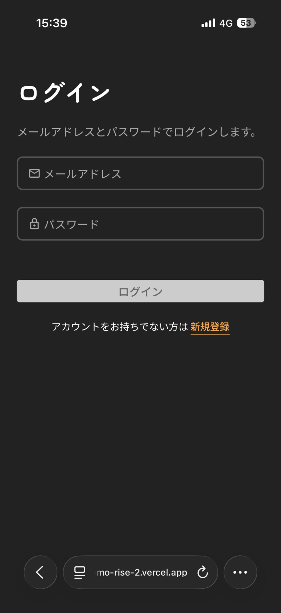 | 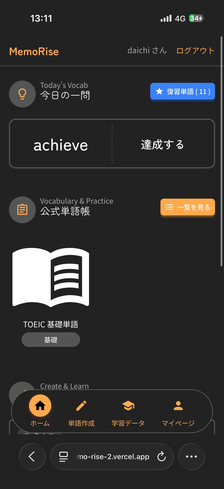 | 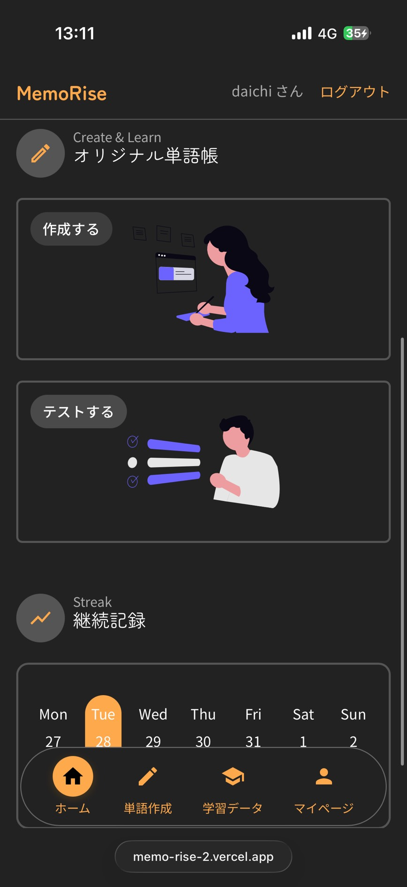 |

自作単語帳は、一覧から単語帳を開いてそのまま単語の登録・テスト開始まで 1 画面で完結します。

| 自作単語帳の一覧 | 単語帳の詳細（単語の登録） |
| :---: | :---: |
| 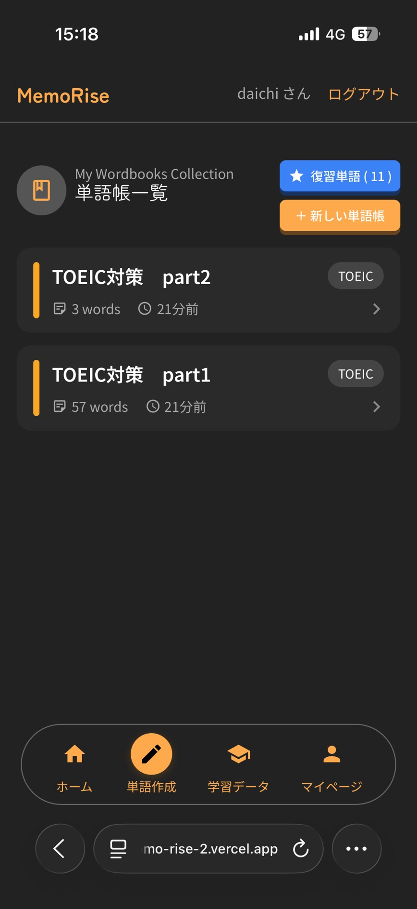 | 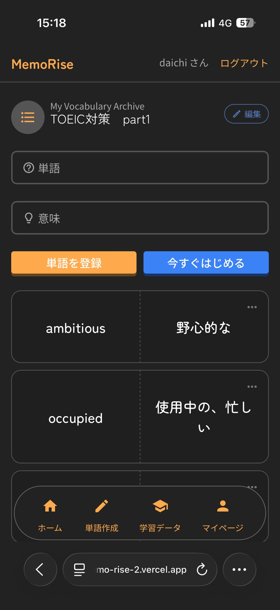 |

### 2. 公式単語帳 — 章を順に解放しながら進む

自作の手間なく始められるプリセット教材。**教材 → 章（Part）** の親子構造で、章のテストを完了すると次の章が解放されます。

| 公式単語帳の教材トップ（解放済み・ロック中の章） |
| :---: |
| 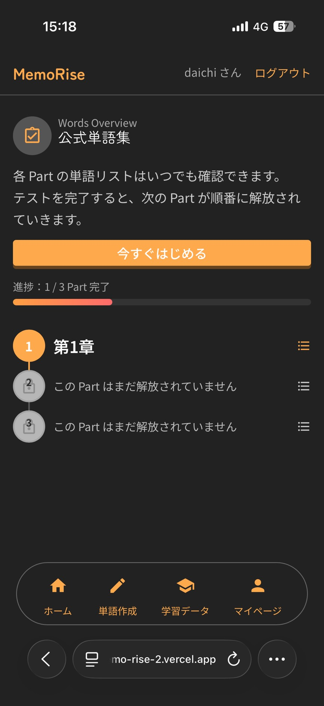 |

**進捗はサーバー側で保持** — 解放状態はクライアントの一時状態ではなく `wordbookProgresses` に保存。先頭章はサーバーが遅延作成し、章の完了と次章の解放は同一トランザクションで確定させる（`completeWordbookProgress`）。

**「今すぐはじめる」で迷わせない** — 未完了かつ解放済みの先頭章へ直接飛ばすので、どこから再開するか考えずに済む。

**解放済みの章はいつでも読み返せる** — テストを受け直さなくても単語リストだけを確認できる。ロック中の章は一覧アイコンごとグレーの非リンクにして、押せないものを押させない。

> 教材のカテゴリ一覧（TOEIC / 英検 等）は管理画面の一覧（後述の admin）と同じ見た目のため省略しています。

### 3. テスト → 自己採点 → 復習（中核の体験）

出題中も結果画面も**正答率をその場で返し**、誤答は 1 タップでまとめて復習リストへ送れます。復習リストは単語帳を横断して出題できるので、苦手が単語帳の中に埋もれません。

| 単語テスト（自己採点） | テスト結果（誤答をまとめて登録） | 復習単語（横断テスト） |
| :---: | :---: | :---: |
| 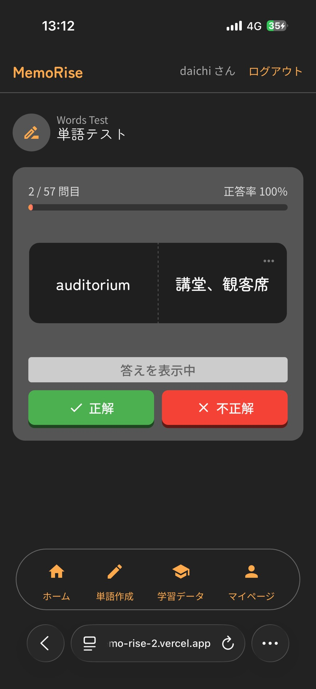 | 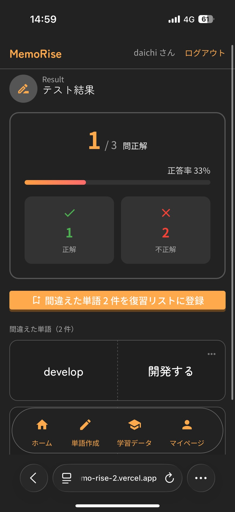 | 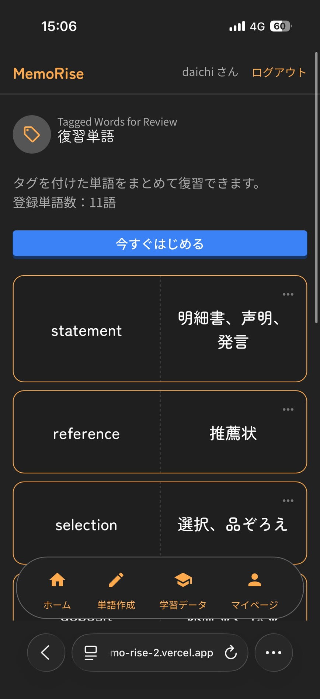 |

### 4. 継続の可視化

連続学習日数（streak）と学習カレンダーで「積み上がっている感覚」をつくります。

| 今週の継続記録 | 学習カレンダー（月送り） | 学習記録の一覧 | マイページ |
| :---: | :---: | :---: | :---: |
| 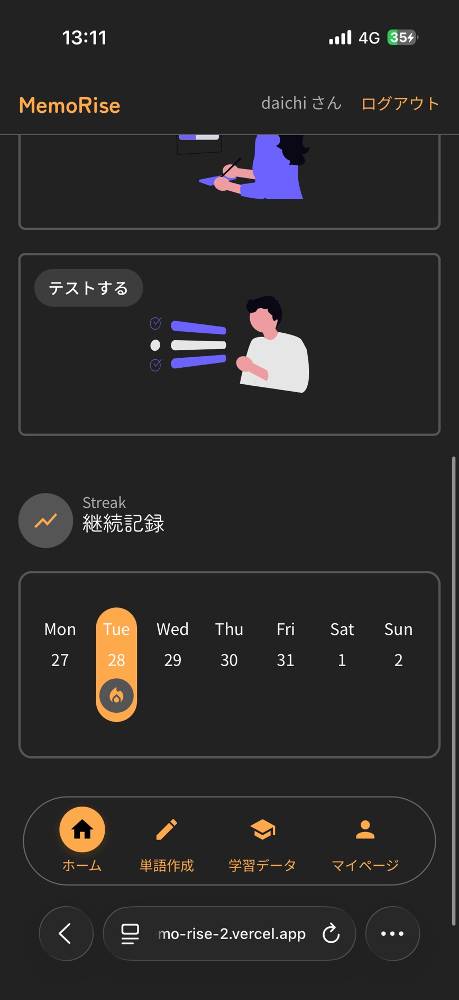 | 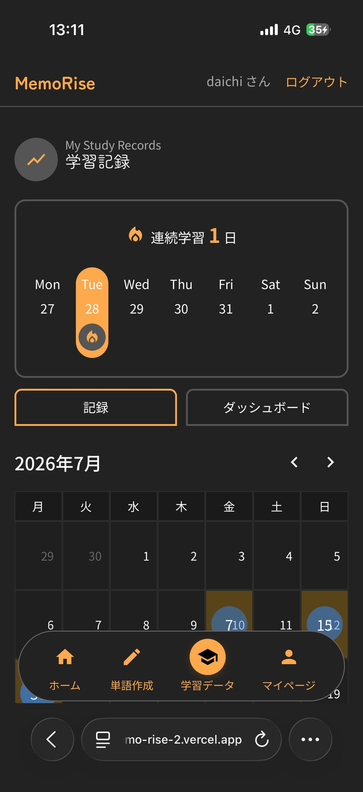 | 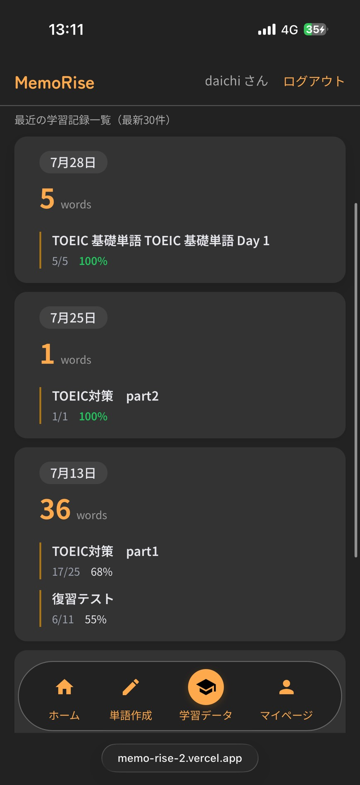 | 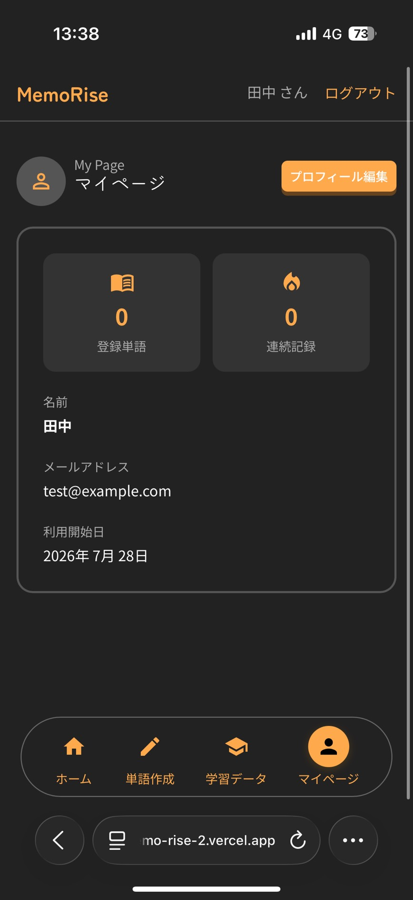 |

### 5. 管理者機能

一般ユーザーとは**認証スコープを完全に分離**した管理画面。公式単語帳を「教材 → 章（Day）→ 単語」の階層で管理します。

| 管理者ダッシュボード | 公式単語帳の管理（カテゴリ別） | 教材の章管理 |
| :---: | :---: | :---: |
| 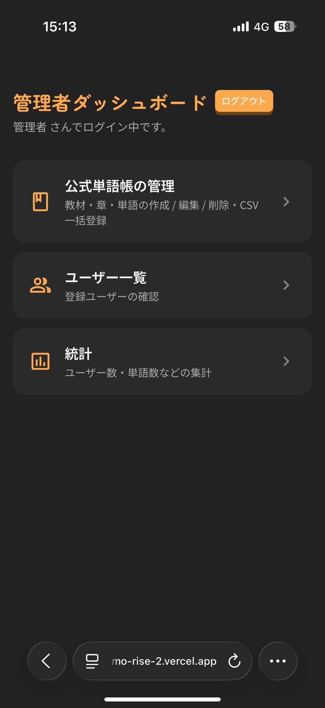 | 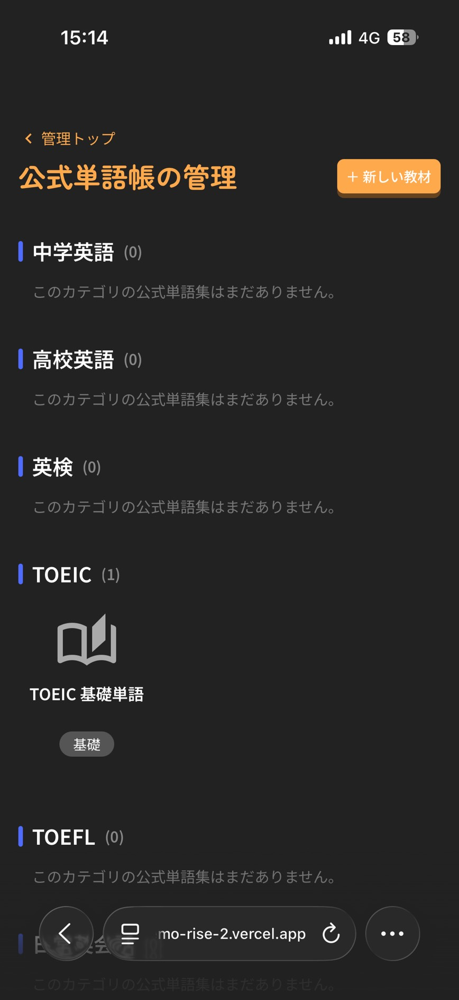 | 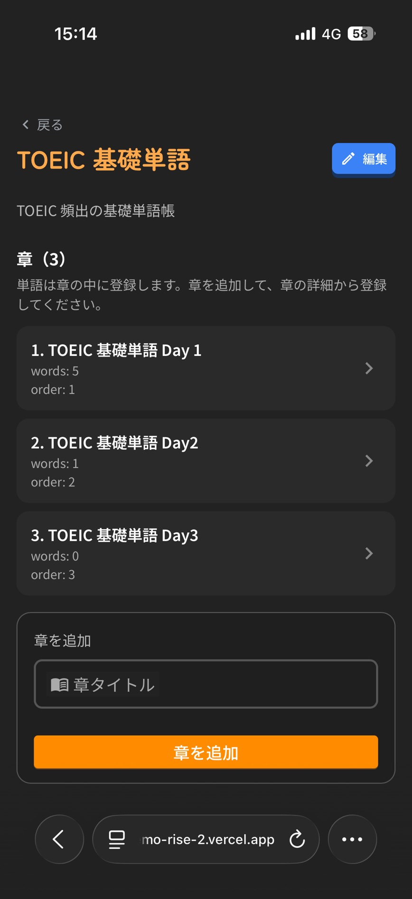 |

単語の登録は 1 件ずつだけでなく、**章ごとの CSV 一括登録**にも対応しています（ファイル選択・テキスト直接入力のどちらでも可）。教材を用意する側の作業量が実運用の律速になるため、まとめて入れる導線を用意しました。

| CSV 一括登録 | 統計 |
| :---: | :---: |
| 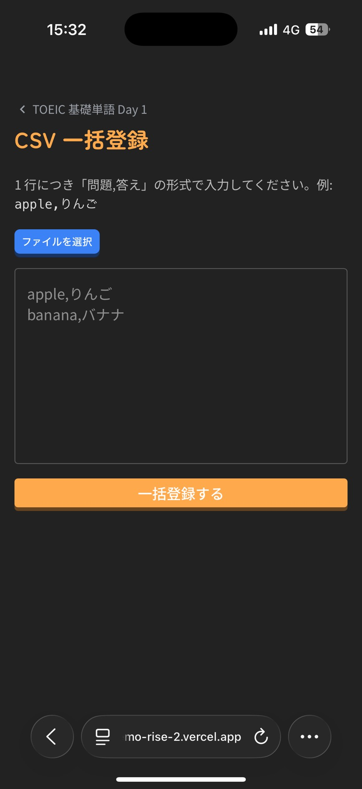 | 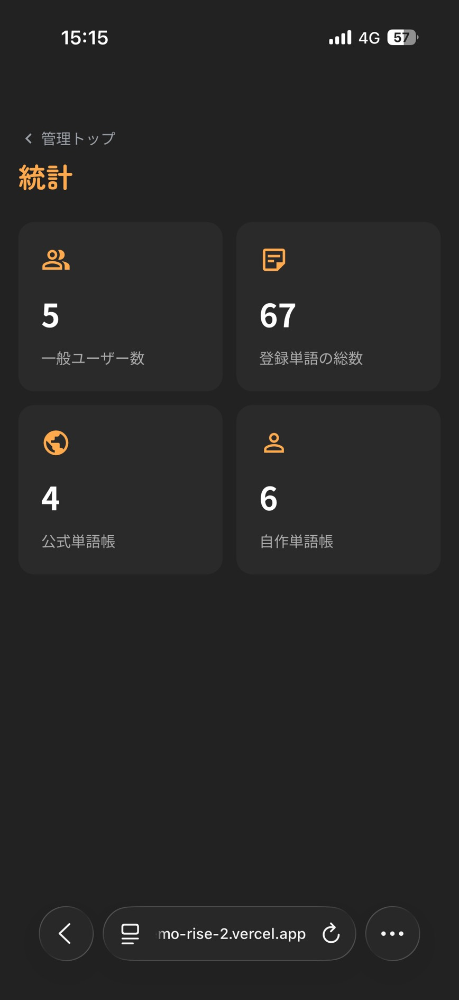 |

---

## 主な機能

- **ホーム** — 「今日の一問」、今週の streak、「あと N 個復習」バッジで学習導線を集約。
- **公式単語帳** — 運営が用意したプリセット（TOEIC / 英検 等）を親子階層（教材 → 章 / Part）で閲覧・テスト。**章のテストを完了すると次の章が順番に解放**される（進捗はサーバー保存）。
- **自作単語帳** — 単語帳・単語の作成 / 編集 / 削除（CRUD）。
- **単語テスト** — 出題 → 自己採点 → 結果サマリー（正答率・正解 / 不正解の内訳）→ **誤答をまとめて復習リストへ登録**（確認モーダルつき）。
- **復習** — 復習タグの付いた単語だけを横断的にテスト。
- **学習記録** — 日次の学習量を記録し、カレンダー・streak で可視化。
- **マイページ** — 登録単語数・連続記録の確認とプロフィール編集。
- **管理者機能** — 公式単語帳の CRUD・CSV 一括登録、ユーザー一覧、統計閲覧（一般ユーザーとは**認証スコープを完全分離**）。

---

## 技術スタック

### フロントエンド

| 分類 | 技術 |
| --- | --- |
| フレームワーク | Next.js 16（App Router） / React 19 |
| 言語 | TypeScript 5 |
| UI | MUI 7（material / icons / x-date-pickers）+ Emotion |
| データ通信 | Apollo Client 4 / GraphQL 16 |
| 型生成 | GraphQL Code Generator（client-preset・スキーマ SDL 起点） |
| テスト | Playwright（E2E） |
| 静的解析 | ESLint 9 |
| パッケージ管理 | npm workspaces（Node 22） |

### バックエンド

| 分類 | 技術 |
| --- | --- |
| フレームワーク | Ruby on Rails 8.1（API モード） / Ruby 3.4.5 |
| API | GraphQL（graphql-ruby、開発時 GraphiQL） |
| データベース | PostgreSQL 16 |
| Web サーバー | Puma |
| 認証 | bcrypt（has_secure_password）+ DB セッション（activerecord-session_store） |
| CORS | rack-cors |
| テスト | RSpec / FactoryBot / shoulda-matchers |
| 品質・セキュリティ | RuboCop（omakase） / Brakeman / bundler-audit |

詳細な採用理由は [docs/tech-stack.md](./docs/tech-stack.md) を参照。

---

## アーキテクチャ（本番構成）

FE = Vercel / BE = Render / DB = Neon（いずれもマネージド）。ブラウザからの GraphQL は
**同一オリジンの `/graphql`** で受け、Vercel のリライトでサーバー側から Render へ転送します。

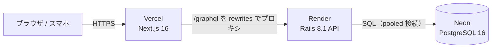

| 層 | サービス | 補足 |
| --- | --- | --- |
| フロント | Vercel | Root Directory = `packages/frontend`。ビルド時に GraphQL Codegen を実行 |
| バック | Render（Docker / Singapore） | 起動時に `db:migrate`、ヘルスチェック `/up` |
| DB | Neon（PostgreSQL 16） | アプリは pooled 接続、マイグレーションは direct 接続 |

---

## 設計上のこだわり

- **認証は DB セッション（Cookie）方式** — トークンを手動管理せず、`session_id` のみを Cookie に載せ実体は DB（sessions テーブル）に保持。一般ユーザーと管理者で認証スコープ（`current_user` / `current_admin`）を完全分離。
- **クロスサイト / ITP 対策** — FE と BE が別ドメインのため、本番の Cookie は `SameSite=None; Secure`。さらに iOS/Safari のサードパーティ Cookie ブロック（ITP）を回避するため、`/graphql` を **同一オリジンにプロキシ**してファーストパーティ Cookie 化。
- **認可はリソース単位で「存在を教えない」** — 自作単語帳などは `user_id` 引数ではなく `current_user` スコープで引き、他人・対象外・論理削除済みは *not found* として扱う。
- **mutation は success / errors 方式** — 例外ではなく `{ success, errors: [{ field, message }] }` を返し、フォームは field 名でエラーを引く。
- **Redis を使わない構成** — セッション・（将来的にキュー / キャッシュ）を PostgreSQL に寄せ、インフラをシンプルに保つ Rails 8 の Solid 系方針。

---

## 開発プロセス

個人開発ながら、チーム開発を想定した運用で進めています。

- **Issue 駆動** — Issue → ブランチ `<種別>/issue-<番号>` → 実装 + テスト同一 PR → 自己レビュー → CI グリーン → Squash merge。
- **CI（GitHub Actions）** — PR ごとに以下を自動実行（[.github/workflows/ci.yml](./.github/workflows/ci.yml)）。
  - フロント：ESLint → `next build` → Playwright E2E
  - バック：RuboCop → RSpec
- **テスト方針**
  - BE：GraphQL は 1 オペレーション 1 spec（`spec/requests/graphql/`）。認可は context 注入で検証。
  - FE：E2E は `page.route("**/graphql")` で GraphQL をモックし、バックエンド非依存で機能単位に検証。
- **Conventional Commits** — type は英語、説明は日本語。

---

## ローカルでの起動

### A. Docker で全部立ち上げる（推奨）

```bash
# 1. 環境変数を用意
cp .env.example .env

# 2. ビルド → DB 作成・マイグレーション（初回のみ） → 起動
docker compose build
docker compose run --rm backend bin/rails db:create db:migrate
docker compose up
```

起動後：

- フロント：http://localhost:3200
- バックエンド（ヘルスチェック）：http://localhost:3100/up
- GraphQL エンドポイント：http://localhost:3100/graphql （POST）

疎通確認：

```bash
curl -X POST http://localhost:3100/graphql \
  -H "Content-Type: application/json" \
  -d '{"query":"{ health }"}'
# => {"data":{"health":"MemoRise GraphQL API is running"}}
```

### B. フロントだけ npm で立ち上げる

```bash
cd packages/frontend
cp .env.local.example .env.local   # 必要なら GraphQL URL を編集
npm install
npm run dev                        # http://localhost:3200
```

### GraphQL 型の自動生成（Codegen）

```bash
cd packages/frontend
npm run codegen   # スキーマ SDL から src/gql/ に型・フックを生成
```

> 前提バージョン：Node.js 22 / Ruby 3.4.5 / PostgreSQL 16。

---

## ドキュメント

- 要件定義：[docs/requirements.md](./docs/requirements.md)
- バックエンド設計：[docs/backend.md](./docs/backend.md)
- フロントエンド設計：[docs/frontend.md](./docs/frontend.md)
- GraphQL 運用（schema dump → codegen）：[docs/graphql.md](./docs/graphql.md)
- 技術スタック：[docs/tech-stack.md](./docs/tech-stack.md)
- v1 からの変更理由：[docs/migration-rationale.md](./docs/migration-rationale.md)
- 開発フロー：[docs/workflow.md](./docs/workflow.md)
